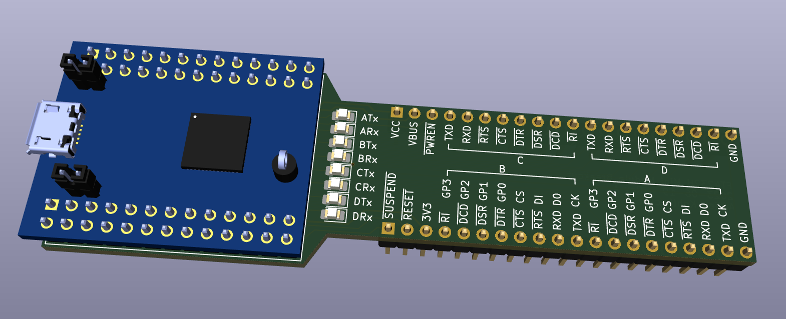
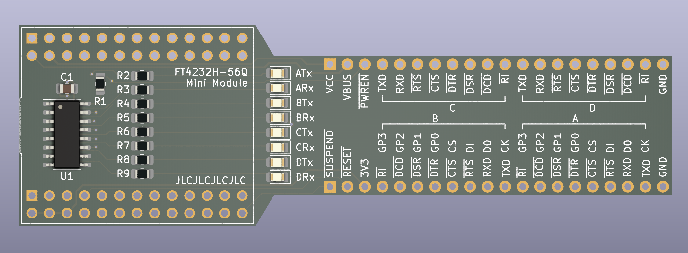
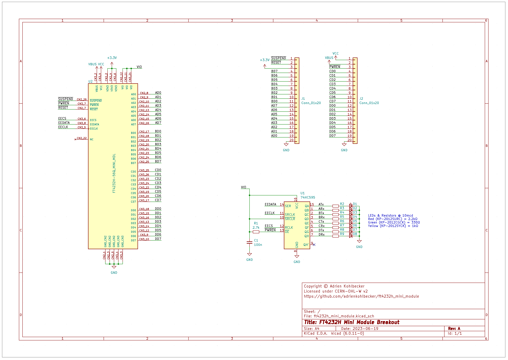

# FT4232H Mini Module Breakout

A breakout board for FTDI's FT4232H Mini Module. The size is friendly for breadboard use, with two rows of holes left available on each side of the breadboard for wires to come in.

## Board

## Schematic

## BOM

| Refs | Qty | Component | Description |
| ----- | --- | ---- | ----------- |
| C1 | 1 | 100n | Ceramic capacitor, SMD 0805 |
| D1, D2, D3, D4, D5, D6, D7, D8 | 8 | LED | Light emitting diode, SMD 0805 |
| J1, J2 | 2 | Conn_01x20 | Generic connector, single row, 01x20 |
| R1 | 1 | 2.7k | Resistor, SMD 0805 |
| R2, R3, R4, R5, R6, R7, R8, R9 | 8 | R | Resistor, SMD 0805. Value depends on chosen LED |
| U1 | 1 | 74HC595 | 8-bit serial in/out Shift Register 3-State Outputs SOIC-16 |
| U2 | 1 | FT4232H-56Q_MINI_MDL | FT4232H Mini Module, or two 2x13 Dupont sockets |
